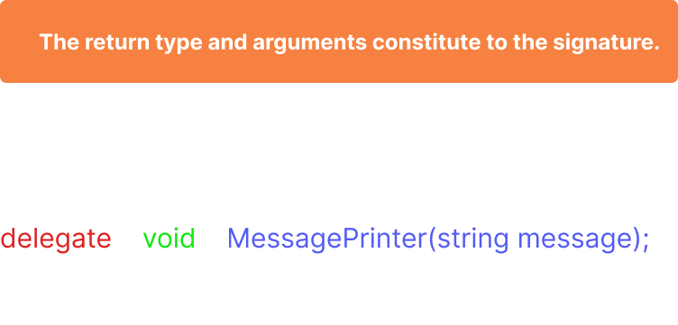

# Delegates in c#

# what is it and how to use?

a delegate holds reference to functions and by calling a delegate we can **call all the functions it references**. Take a look at the code below to have a better picture,

```csharp

public static class Main
{
	// delegate
  delegate void MessagePrinter(string message);

  static void PrintMessageWithStars(string msg)
  {
    Console.WriteLine($"***{msg}***");
  }

  static void PrintMessageWithHahes(string msg)
  {
    Console.WriteLine($"###{msg}###");
  }

  public static void Start()
  {
    MessagePrinter printer = PrintMessageWithHahes; // another way to instantiate: var printer = new MessagePrinter(PrintMessageWithHahes);
    // we can add functions to a delegate using plus operator like so
    printer += PrintMessageWithStars;
    // calling the delegate printer will invoke PrintMessageWithHahes and PrintMessageWithStars
    printer(" Thanks for reading ");
    /* Output:
    ### Thanks for reading ###
    *** Thanks for reading ***
    */
  }
}
```

similarly you can **also add instance methods** to the delegates, the only constraint is the functions signature should match the delegates signature. In the above example we can add any function (static or instance method) to the printer delegate which takes 1 argument of type string and returns void.



# when and where to use?

Think of delegates like a subscription, for example in your app, you may have a service which does some CRUD operations on database and you want to subscribe to the success or failure events of database operations. Take a look at the code below for a better understanding

```csharp
public static class UsersService
{
  // event handler methods of the below signature can be used to handle Database operation events
  public delegate void DatabaseOperation(bool isSuccessful, string msg);

  // used to invoke the event handler methods
  public static DatabaseOperation DatabaseOperationEventHandler;

  public static void AddUser(string name)
  {
    try
    {
      var newUser = name;
      // do some db operation
      DatabaseOperationEventHandler(true, "new user added");
    }
    catch (Exception ex)
    {
      DatabaseOperationEventHandler(false, ex.Message);
    }
  }
}

public static class Main
{
  public static void Start()
  {
    // subscribe to the database operation events
    UsersService.DatabaseOperationEventHandler += (bool isSuccessful, string msg) =>
    {
      if (isSuccessful)
      {
        Console.WriteLine("success is not a destination it's a journey!!!");
      }
      else
      {
        Console.WriteLine(msg);
      }
    };

    UsersService.AddUser("karthik");
  }
}
```

Now the UserService is only responsible for doing database operations on Users and the succuss or failure of these operations is handled by the event handler, this encourages single responsibility and keeps the code clean. You can achieve the same functionality without using delegates but using them makes the code more readable and understandable.

To summarize, delegates holds references to functions which match the signature and you can use delegates to define handlers for events happening elsewhere.

If you enjoyed reading the article, please consider following me here on hashnode, Thanks 🙏 for reading.
